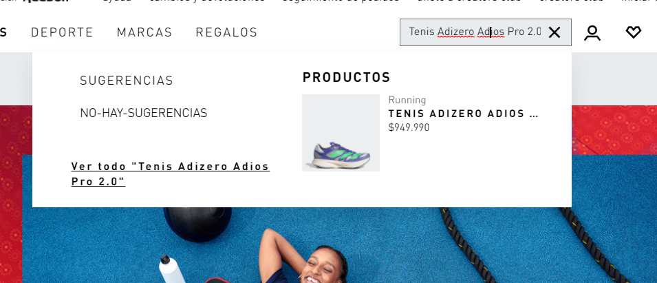
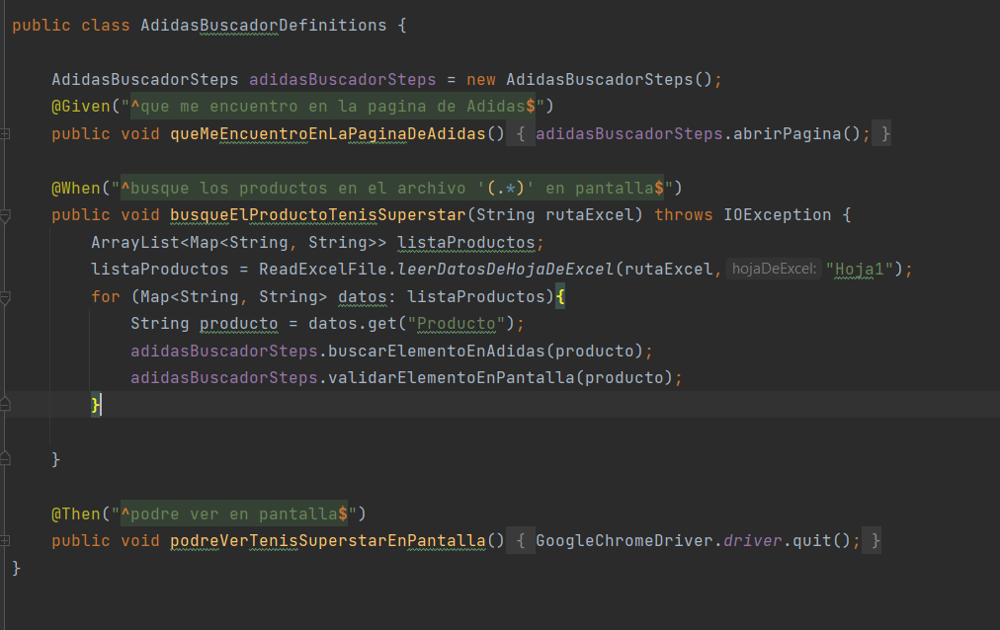
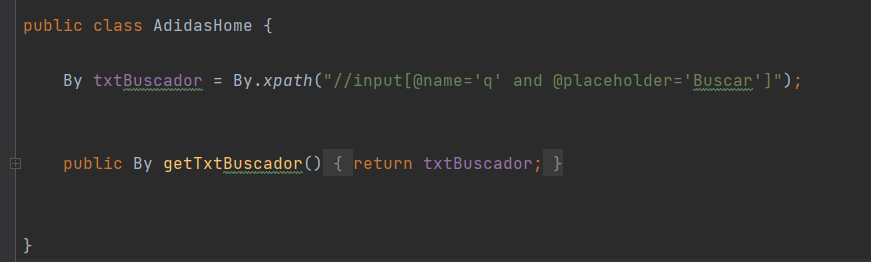
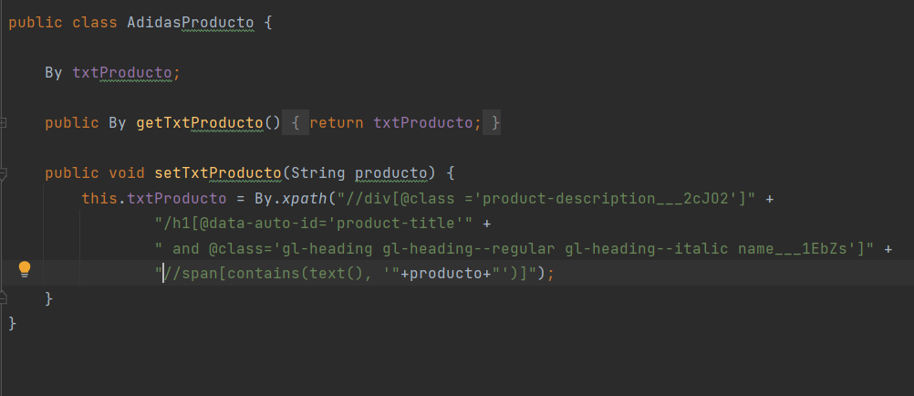

# Reto de automatizacion pagina: 'adidas.co'
## Test Automaticación busque producto con carga de datos desde un archivo excel

### Descripción

		Para este reto se tenía que automatizar la búsqueda de 5 productos mediante el buscador dela 
		página "adidas" y verificar que  efectivamente fuera el producto buscado.
		
## Se abre la pagina "Adidas"	

	
## Se busca el producto	
	

## Se ve el pruducto que se busco y es el que se verifica

 

### Infomación proyecto
<table>
<tr>
  <th>Dependencias</th>
  <td>
     * <a> implementation 'net.serenity-bdd:serenity-junit:2.0.80'</a> 
	 *<a> implementation 'net.serenity-bdd:serenity-cucumber:1.9.45'</a> 
	 *<a> implementation 'net.serenity-bdd:serenity-junit:2.0.80'</a> 
	 *<a> implementation 'org.slf4j:slf4j-simple:1.7.7'</a> 
	 *<a> implementation group: 'org.apache.poi', name: 'poi', version: '3.17'</a> 
	 *<a> implementation group: 'org.apache.poi', name: 'poi-ooxml', version: '3.17'</a> 
	 *<a> chromedriver.exe</a>
    </td>
<tr>
<tr>
  <th>Estructura</th>
  <td>
      <a> Selenium POM + Cucumber</a>
  </td>
<tr>
</table>

 
+ paquetes:
	+ runners: AdidasBuscadorStepsRunner.java.

			SE ejecuata el proyecto.

	+ stepsDefinitions: AdidasBuscadorDefinitions.java.

		 

			En el when creo una variable local de tipo   ArrayList<Map<String, String>> listaProductos; 
			Donde estaran los datos de prueba.
			
			luego los recorro mediante un for-ech.
			busco el producto con adidasBuscadorSteps meidante el metodo  buscarElementoEnAdidas.
			
			Luego de buscarlo con adidasBuscadorSteps mediante el metidi  validarElementoEnPantalla
			que verificara si es o no el producto.

	+ readExcel: ReadExcelFile.java

			 El paquete lo utilizo para estructurar el codigo.
			 
			 La clase sirve para poder cargar el excel con el metodo "leerDatosDeHojaDeExcel",
			 el cual recibe como parametros  la ubicación  del archivo y la hoja 
			 que se quiere leer y extrar los datos.
			 
			 Ademas es estatico con esto no se necesita instanciar la clase para poder utilizarlo.

	+ dataExcel:  datos.xlsx

			 El paquete lo utilizo para estructurar el codigo.
			 
			 El archivo  contiene los datos de prueba que son:
			 
				- Tenis Adizero Adios Pro 2.0
				- Tenis Superstar Star Wars
				- Chaqueta para Lluvia Millonarios FC
				- Camiseta Arsenal Teamgeist
				- Chaqueta Deportiva Beckenbauer Blue Versión

	+ features: AdidasBusqueda.feature

		Feature: HU-001 Buscador Adidas
		
		Yo como usuario de Adidas Quiero buscar un producto en la plataforma Para ver el nombre del
		producto en pantalla.
		
		Scenario: Buscador producto.
		
		Given que me encuentro en la pagina de Adidas.
			
		When  busque los productos en el archivo 'src\test\java\dataExcel\datos.xlsx' en pantalla.
			
		Then podre ver en pantalla.
			
	* steps: AdidasBuscadorSteps.java
	
	 	 en esta clase tengo:
		 
	 	 	* buscarElementoEnAdidas(String producto):
	 	 	
	  		ingresa el nombre del producto en el buscador de la pagina  y lo busca.
			
	 	 	* validarElementoEnPantalla(String producto) :
	 	 
		 	valida que el producto en pantalla sea el mismo que sea el mismo de la prueba dle excel.
			
	+ pages

	AdidasHome.java:
		 
	
	
			Contiene los Xpath necesarios de la vista principal de la pagina para realizar las pruebas

	

			
	 AdidasProducto.java:
	 
	 
		
	 		 Contiene los Xpath necesarios de la vista del procducto de la pagina para realizar las pruebas en este
			 caso un span que contiene el nombre el producto.
			 

